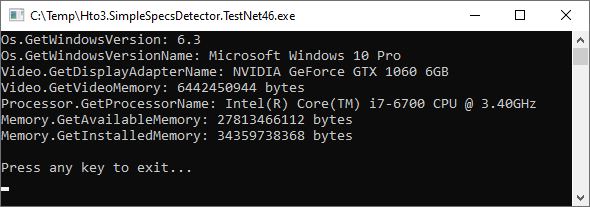



Hto3.SimpleSpecsDetector
========================================

#### Nuget Package
[](https://www.nuget.org/packages/Hto3.SimpleSpecsDetector/)

Fully managed .NET library to detect the specs of the hardware, available in .NET Framework or .NET Core flavors (.NET Standard). This library intends to keep direct and simple, don't expect to retrieve all geek info like HWiNFO, AIDA64 or Speccy provides.

This library is ideal for obtaining simple information from Desktops and Servers, perhaps for a troubleshooting or inventory, or simply to use in the log of your application.

##### Example



 

Supported Windows Versions
--------
-   Windows 10
-   Windows Server 2019
-   Windows Server 2016
-   Windows 8.1
-   Windows Server 2012 R2
-   Windows 8
-   Windows Server 2012
-   Windows 7
-   Windows Server 2008 R2
-   Windows Server 2008
-   Windows Vista
-   Windows Server 2003 R2
-   Windows Server 2003
-   Windows XP 64-Bit Edition
-   Windows XP

Supported Linux Versions
--------
-   Same as .NET supported list ([link](https://docs.microsoft.com/dotnet/core/install/linux)).

Supported .NET Versions
--------
-   .NET Framework 4.x
-   .NET Core 2.x and 3.x (through .NET Standard)
-   .NET 5.0

Features
--------

### Os
- `GetOsVersionNumber` Windows: Get the correct Windows version following the Microsoft table (https://docs.microsoft.com/en-us/windows/win32/sysinfo/operating-system-version).
   Linux: Get the VERSION_ID value.
- `GetOsVersionName` Get the OS version name.
- `GetInstalledFrameworkVersion` Get the higher .NET Framework version installed on machine. This method can detect starting from 4.0 version.
- `GetSystemUpTime`Get system up time.

### Processor
- `GetProcessorName` Get the processor name.

### Video
- `GetDisplayAdapterName` Get the display adapter name.
- `GetVideoMemory` Get amount of memory of the display adapter. Result in bytes. 
- `GetCurrentVideoResolution` Get the resolution in pixels of the current display in use (focused).

### Memory
- `GetFreeMemory` Number of bytes of physical memory currently unused and available.
- `GetInstalledMemory` Get the amount of installed physical memory in bytes.
- `GetVisibleMemory` The total amount of physical memory (in Bytes) available to the OperatingSystem. This value does not necessarily indicate the true amount of physical memory, but what is reported to the OperatingSystem as available to it.

### Motherboard
- `GetVendorName` Get the vendor name.
- `GetModel` Get the motherboard model.
- `GetBIOSVersion` Get the BIOS version.

### Storage
- `GetDisks` Get all connected hard disks. The information available is the hard disk name and size.

### Sound
- `GetSoundCards` Get all connected sound cards.

### Printer
- `GetPrinters` Get all installed printers.

### Network
- `GetNetworkCards` Get all connected network cards. 

Sample App
----------

```C#
class Program
{
    static void Main(string[] args)
    {
        //Os
        Console.WriteLine("Os.GetOsVersionNumber: {0}", HardwareDetector.OsDetector.GetOsVersionNumber());
        Console.WriteLine("Os.GetOsVersionName: {0}", HardwareDetector.OsDetector.GetOsVersionName());
        Console.WriteLine("Os.GetInstalledFrameworkVersion: {0}", HardwareDetector.OsDetector.GetInstalledFrameworkVersion());
        Console.WriteLine("Os.GetSystemUpTime: {0}", HardwareDetector.OsDetector.GetSystemUpTime());
        Console.WriteLine("Os.GetKernelVersion: {0}", HardwareDetector.OsDetector.GetKernelVersion());

        //Video
        Console.WriteLine("Video.GetDisplayAdapterName: {0}", HardwareDetector.VideoDetector.GetDisplayAdapterName());
        Console.WriteLine("Video.GetVideoMemory: {0} bytes", HardwareDetector.VideoDetector.GetVideoMemory());
        Console.WriteLine("Video.GetCurrentVideoResolution: {0}", HardwareDetector.VideoDetector.GetCurrentVideoResolution());

        //Processor
        Console.WriteLine("Processor.GetProcessorName: {0}", HardwareDetector.ProcessorDetector.GetProcessorName());

        //Memory
        Console.WriteLine("Memory.GetFreeMemory: {0} bytes", HardwareDetector.MemoryDetector.GetFreeMemory());
        Console.WriteLine("Memory.GetVisibleMemory: {0} bytes", HardwareDetector.MemoryDetector.GetVisibleMemory());
        Console.WriteLine("Memory.GetInstalledMemory: {0} bytes", HardwareDetector.MemoryDetector.GetInstalledMemory());

        //Motherboard
        Console.WriteLine("Motherboard.GetModel: {0}", HardwareDetector.MotherboardDetector.GetModel());
        Console.WriteLine("Motherboard.GetVendorName: {0}", HardwareDetector.MotherboardDetector.GetVendorName());
        Console.WriteLine("Motherboard.GetBIOSVersion: {0}", HardwareDetector.MotherboardDetector.GetBIOSVersion());

        //Storage
        foreach (var disk in HardwareDetector.StorageDetector.GetDisks())
            Console.WriteLine("Storage.GetDisks: {0}", disk);

        //Printers
        foreach (var printer in HardwareDetector.PrinterDetector.GetPrinters())
            Console.WriteLine("Printer.GetPrinters: {0}", printer);

        //Sound cards
        foreach (var soundCard in HardwareDetector.SoundDetector.GetSoundCards())
            Console.WriteLine("Sound.GetSoundCards: {0}", soundCard);

        //Network cards
        foreach (var networkAdapter in HardwareDetector.NetworkDetector.GetNetworkCards())
            Console.WriteLine("Network.GetNetworkCards: {0}", networkAdapter);
    }
}
```