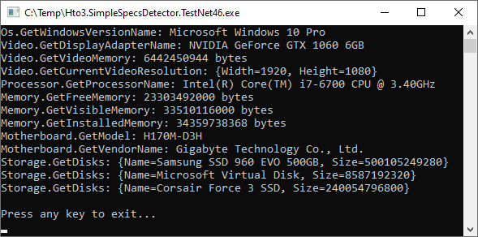

Hto3.SimpleSpecsDetector
========================================

#### Nuget Package

Fully managed .NET library to detect the specs of the hardware, available in .NET Framework or .NET Core flavors (.NET Standard 2.0). This library intends to keep direct and simple, don't expect to retrieve all geek info like HWiNFO, AIDA64 or Speccy provides.

This library is ideal for obtaining simple information from PCs in Windows environment, perhaps for a troubleshooting or inventory, or simply to use in the log of your application.

##### Example

 

Supported Windows Versions
--------
-   Windows XP (.NET 4.0)
-   Windows Vista
-   Windows 7
-   Windows 8
-   Windows 8.1
-   Windows 10
-   ~**Future proof** 🐱‍👤

Supported .NET Versions
--------
-   .NET Framework 4.x
-   .NET Core 2.x (through .NET Standard 2.0)

Features
--------

### Os
- `GetWindowsVersionNumber` Get the correct Windows version.
- `GetWindowsVersionName` Get the Windows version name.

### Processor
- `GetProcessorName` Get the processor name.

### Video
- `GetDisplayAdapterName` Get the display adapter name.
- `GetVideoMemory` Get amount of memory of the display adapter. Result in bytes. 
- `GetCurrentVideoResolution` Get the resolution in pixels of the current display in use (focused).

### Memory
- `GetFreeMemory` Number of bytes of physical memory currently unused and available.
- `GetInstalledMemory` Get the amount of installed phisical memory in bytes.
- `GetVisibleMemory` The total amount of physical memory (in Bytes) available to the OperatingSystem. This value does not necessarily indicate the true amount of physical memory, but what is reported to the OperatingSystem as available to it.

### Motherboard
- `GetVendorName`
- `GetModel`